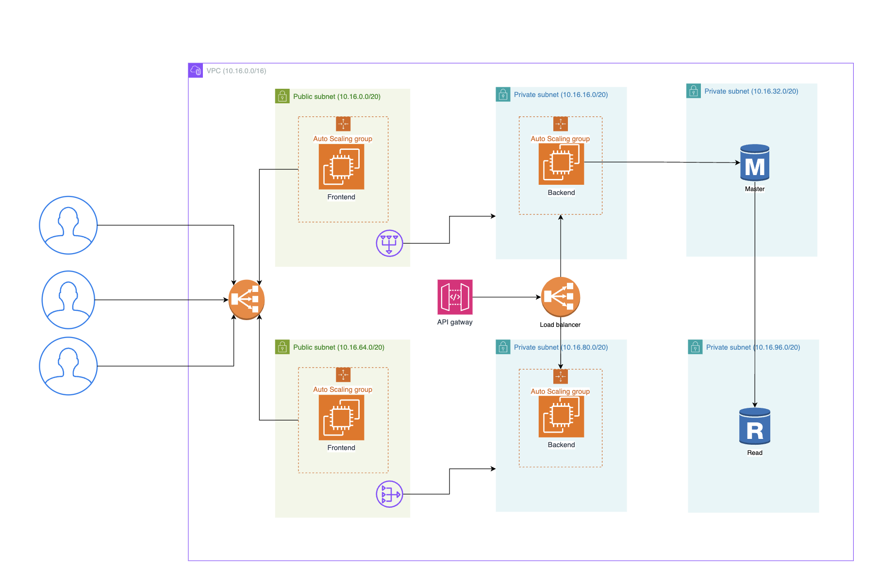
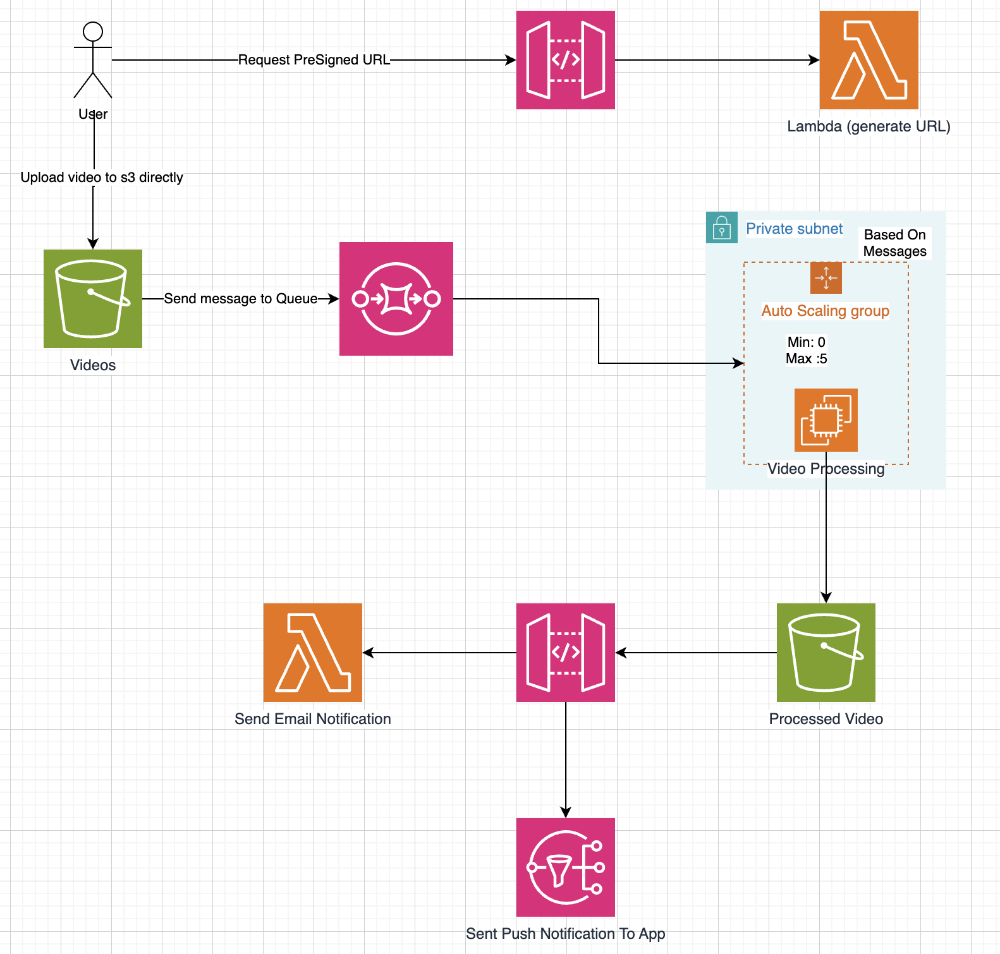
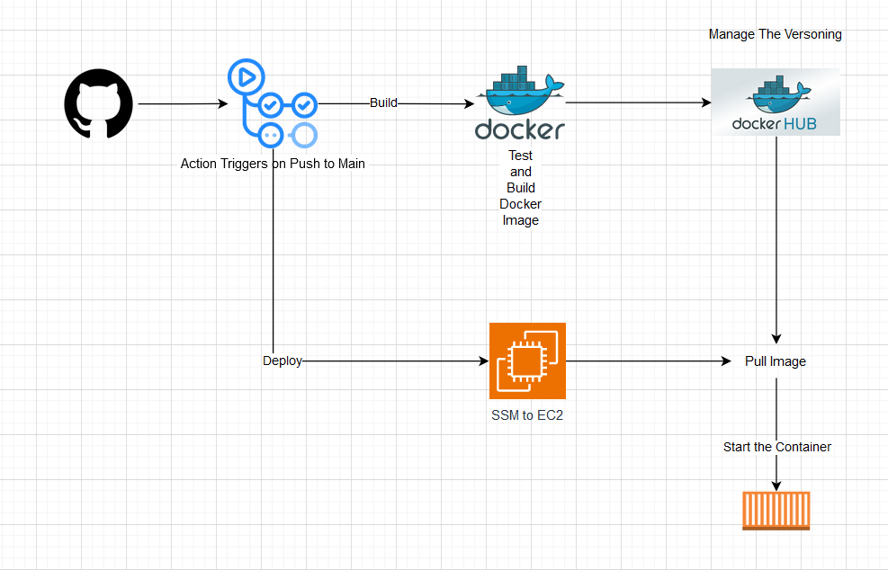

# WhizStream Web Application Architecture

This project deploys a multi-tier web application architecture on Amazon Web Services (AWS) using Amazon Elastic Compute Cloud (EC2) instances. The architecture leverages various AWS services to achieve high availability, scalability, and security.

# Code

1. Frontend (React) :  https://github.com/youtubeMini/WhizStream_Frontend
2. Backend (Nodejs) : https://github.com/youtubeMini/WhizStream_Backend
3. S3 Presigned URL (Lmabda) : https://github.com/youtubeMini/s3-signed-url-lambda
4. Video Processing (Ec2) : https://github.com/youtubeMini/video_processing
   

**Key Components:**

- **Regions:** The application is deployed across multiple isolated AWS regions for redundancy.
- **Public and Private Subnets:** Public subnets host resources accessible from the internet, while private subnets hold application logic and databases for security.
- **Auto Scaling Groups:** These groups automatically manage EC2 instances to handle varying traffic loads.
- **Web Application Tiers:** The architecture follows a three-tier structure:
  - Frontend tier (public subnet) for handling user requests and delivering content.
  - Backend tier (private subnet) for processing requests and interacting with the database.
  - Database tier (private subnet) with a master-read replica configuration for data management.
- **API Gateway:** Acts as a single entry point for API requests, routing them to backend services.
- **Load Balancers:** Distribute traffic across multiple EC2 instances for high availability.

## Uploading and Processing Videos

This section outlines the process for uploading videos to Amazon S3 storage and processing them using AWS Lambda functions.

**Workflow:**

1. **Lambda (generate URL):** An AWS Lambda function is invoked, perhaps to generate a pre-signed URL for uploading the video.
2. **Upload video to S3 directly:** Videos are uploaded directly to an S3 bucket using a presigned URL which is generated by the Lambda function.
3. **Request Pre-Signed URL:** An S3 pre-signed URL is generated to control access permissions for uploading the video.
4. **Send message to Queue:** A message is sent to an SQS queue, and EC2 autoscaling, EC2 process the uploaded video.
5. **Send Email Notification:** An email notification is sent, upon successful video processing.
6. **Sent Push Notification to App:** A push notification is sent to an app to inform users about video processing completion.

## CI/CD Pipeline with AWS

This section describes the continuous integration and continuous delivery (CI/CD) pipeline implemented for this project using Github Action. The pipeline automates the process of building, testing, and deploying the application to Amazon EC2 instances.

**Pipeline Stages:**

1. **Github:** The pipeline starts with code changes being pushed to master branch of github.
2. **Build:** A build stage is triggered, by the github action. This stage builds the docker image and it will be pushed to the Docker Hub.
3. **Build succeeded (Yes):** If the build is successful, the pipeline progresses to the deployment stage.
4. **Build failed (No):** In case of build failures, the pipeline halts, and notifications are sent to developers for troubleshooting.
5. **Deploy:** The deployment stage utilizes Github action to deploy the application to EC2 instances.
6. **Deployment succeeded (Yes):** Upon successful deployment, the pipeline completes.
7. **Deployment failed (No):** If deployment fails, notifications are sent, and rollback mechanisms might be initiated to revert to a previous version.
